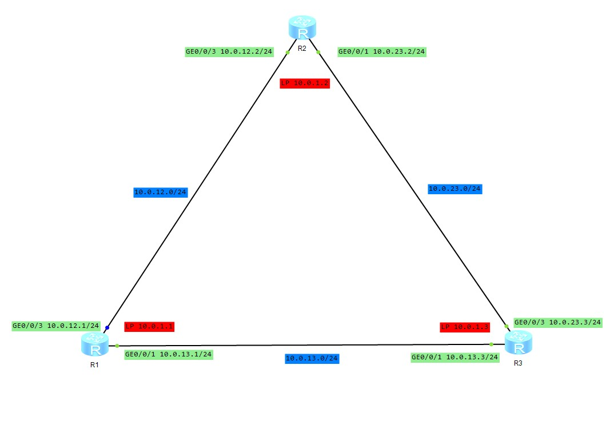

### 什么情况下，配置的静态路由会被添加到IP路由表中？若配置的下一跳不可达，该路由可以被加入到IP路由表吗？

配置下一条不可达，不会被加入路由表

### 当测试 LoopBack 接口连通性时，若不加 -a 参数，则 ICMP 报文的源IP地址将会是多少？为什么？

源 IP 地址是 0/0/1 接口地址，因为这个 目的ip 地址对应的出口是 0/0/1

### 三层网络

1. 源IP地址和目的IP地址不会发生改变（没有NAT情况下)

2. 源MAC地址和目的MAC地址，经过一个转发，改变一次

### 路由表

Destination/Mask | Proto | Pre | Cost | Flags | NextHop | Interface | 说明
--- | --- | --- | --- | --- | --- | --- | ---
0.0.0.0/0 | Static | 60 | 0 | RD | 10.0.12.2 | GE0/0/3 | 默认路由
10.0.12.0/24 | Direct | 0 | 0 | D | 10.0.12.1 | GE0/0/3 | 直连路由
10.0.12.1/32 | Direct | 0 | 0 | D | 127.0.0.1 | GE0/0/3 | 直连路由

### 拓扑

### 模拟三层转发流程

这里假设所有的 MAC 地址都已缓存，不做 ARP 这步

`ping -a 10.0.1.1 10.0.23.3`

解释 | SRC_MAC | DEST_MAC | SRC_IP | DEST_IP
---|--- | --- | --- | ---
路由器R1 发包 | R1_GE0/0/3 | R2_GE0/0/3 | 10.0.1.1 | 10.0.23.3
路由器R2 转发 | R2_GE0/0/1 | R3_GE0/0/3 | 10.0.1.1 | 10.0.23.3
